# Project Excel-Charts
Javascript full-stack project to import excel data, visualize data with interesting UI design (calendar and charts), calculate imbalances, make prediction graphs and export information.

### `pm2 start app`
Runs the app in the production mode. 

### `npm start / nodemon`
Runs the app in the development mode. 
The page will reload if you make edits. 

### `Import menus`
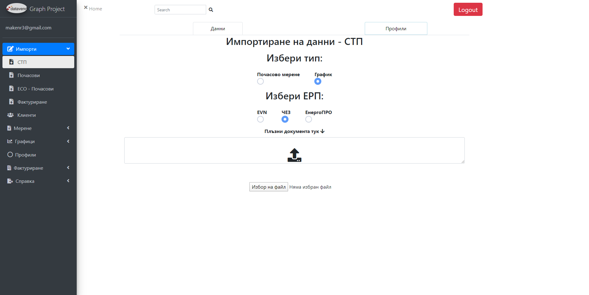
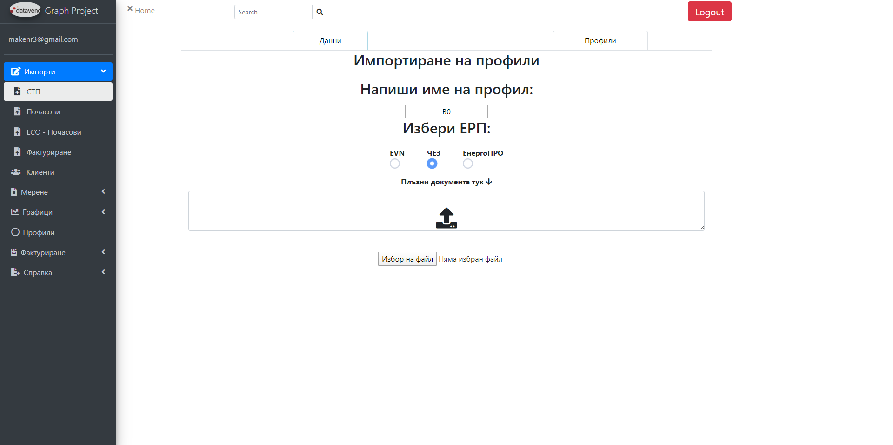
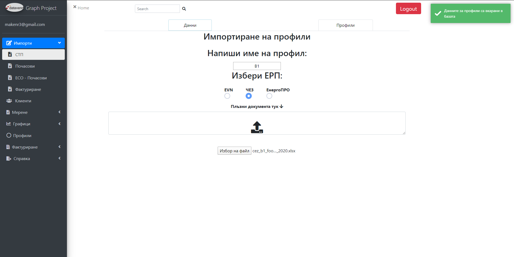
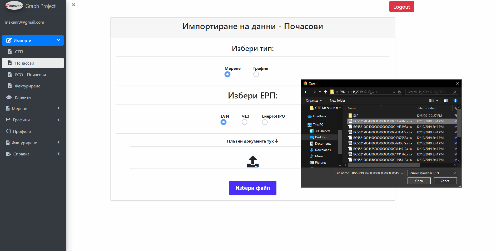

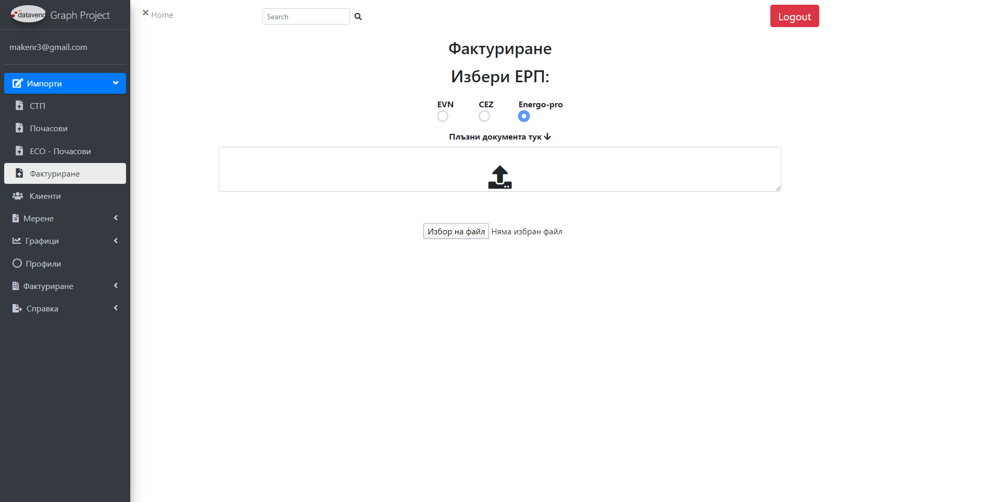

### `Client menu`
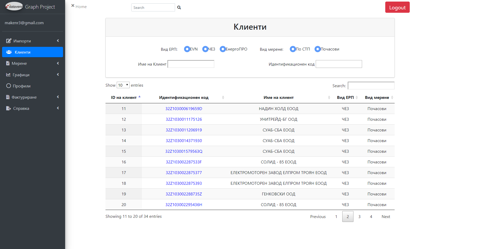
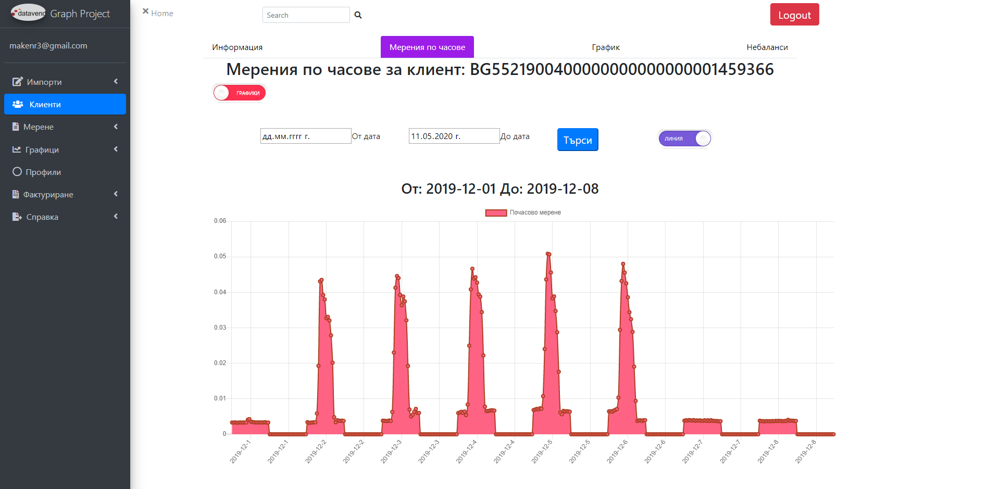
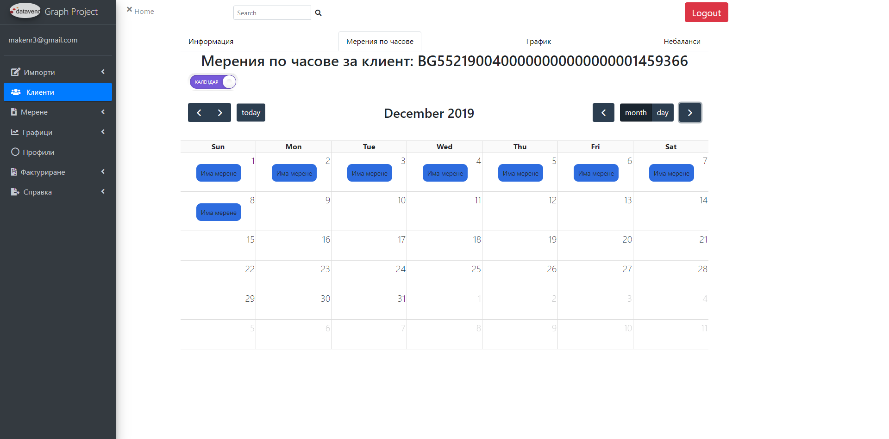

### `Profiles menu`
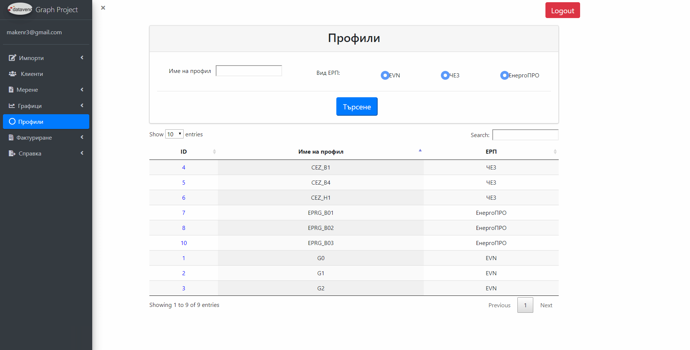
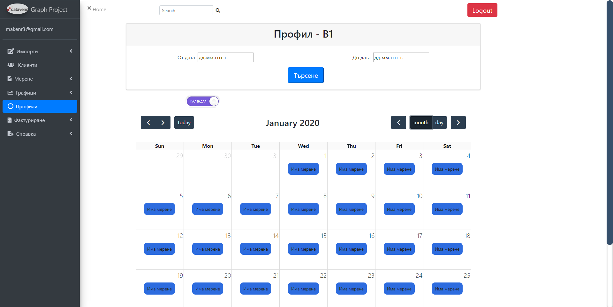
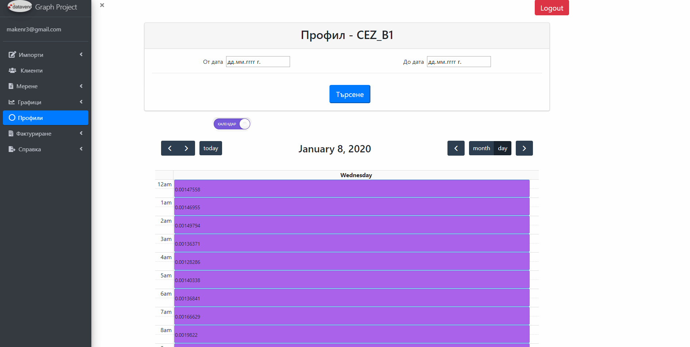
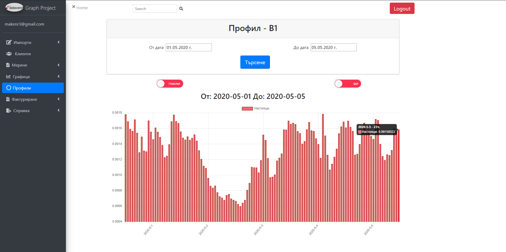
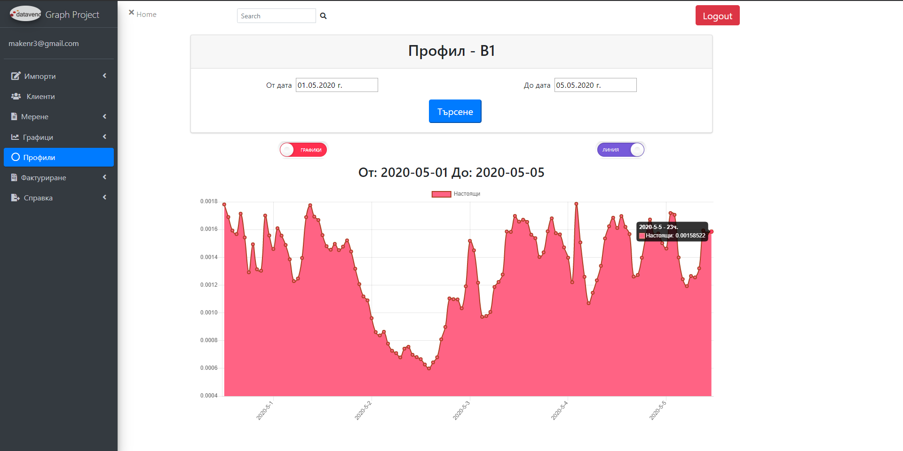

### `Readings menu`

### `ESO Readings menu`
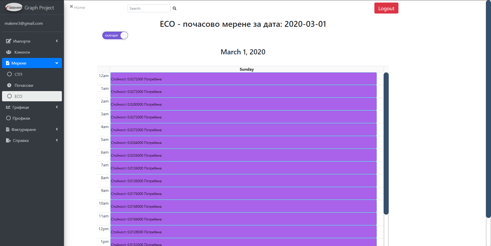
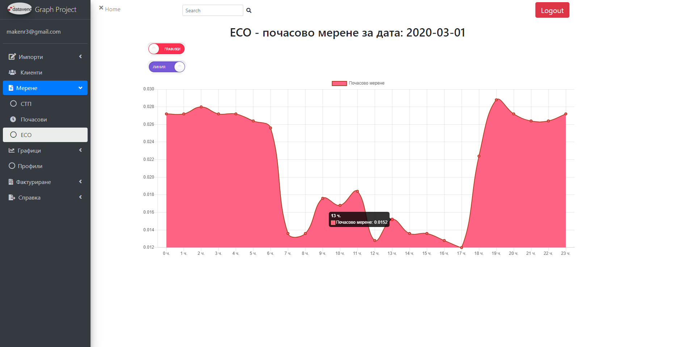
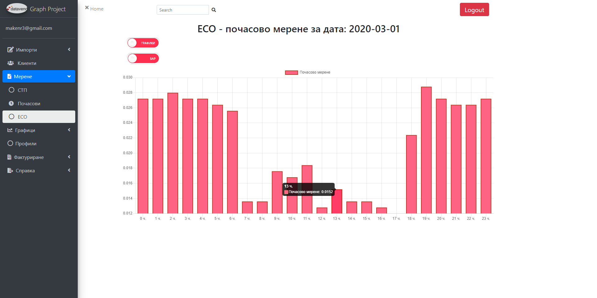

### `Inquiry menu`
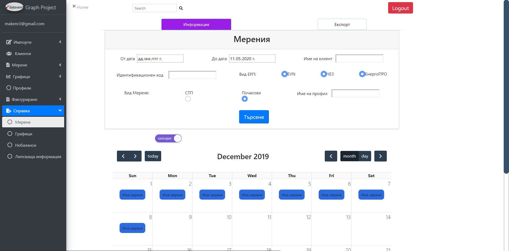
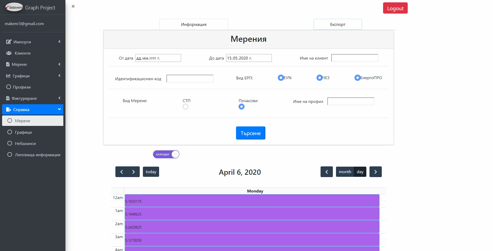
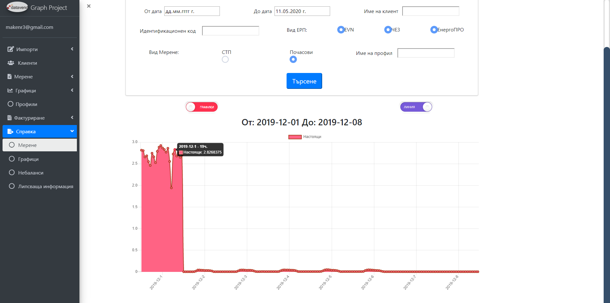
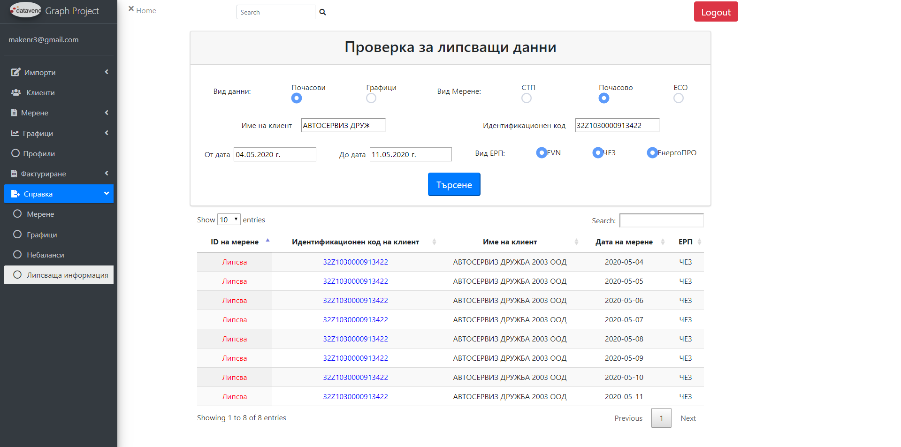

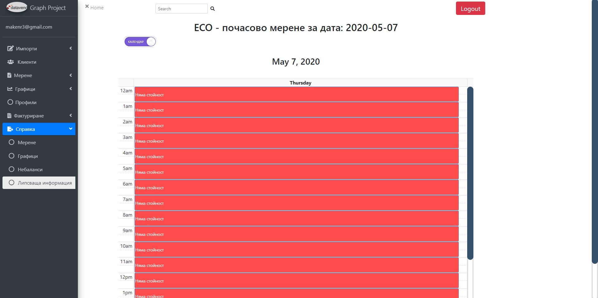
