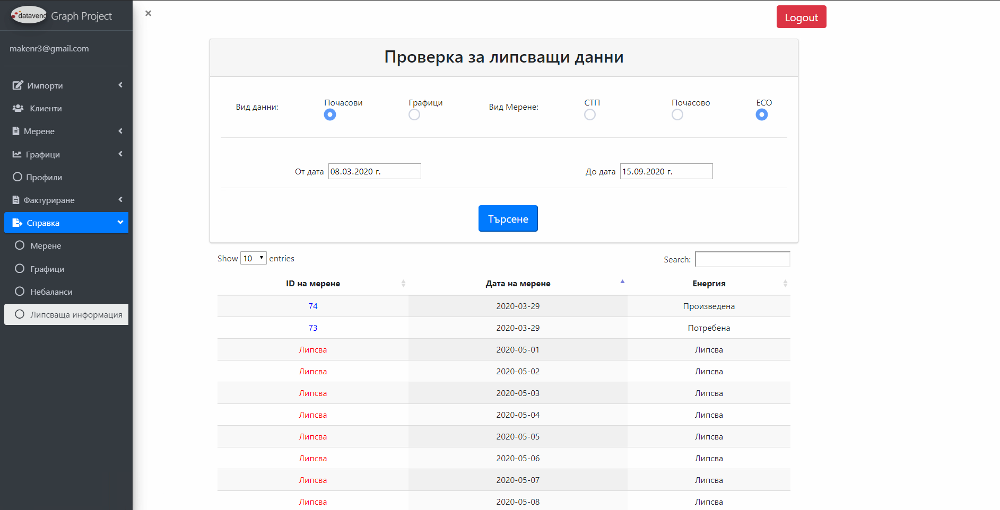

# Project Excel-Charts
Javascript full-stack project to import excel data, visualize data with interesting UI design (calendar and charts), calculate imbalances, make prediction graphs and export information.

### `pm2 start app`
Runs the app in the production mode. 

### `npm start / nodemon`
Runs the app in the development mode. 
The page will reload if you make edits. 

### `Import menus`

### `Client menu`

### `Profiles menu`

### `Readings menu`

### `ESO Readings menu`

### `Inquiry menu`

